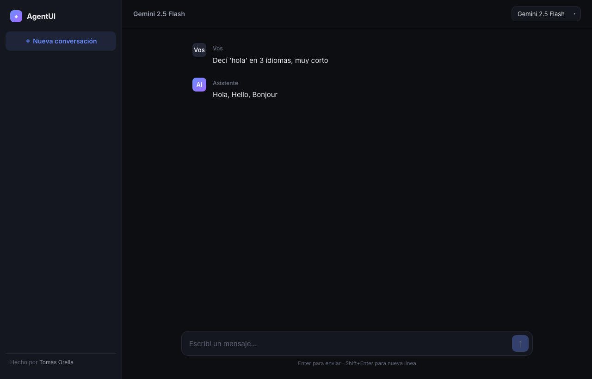

# AgentUI

Interfaz de chat con LLMs construida desde cero — streaming de respuestas en tiempo real, múltiples modelos y persistencia de conversaciones. Pensada como alternativa self-hosted y gratuita a ChatGPT/Claude usando el free tier de Gemini o modelos locales vía Ollama.



## ✨ Features

- **Streaming en tiempo real** — las respuestas aparecen token por token (Server-Sent Events), sin esperar a que termine.
- **Multi-modelo** — cambiá entre **Gemini 2.5 Flash** (cloud, free tier) y **Qwen3 8B** (local vía Ollama) desde un selector.
- **Fallback automático** — si Gemini falla o se agota la cuota, el backend cae a Ollama sin cortar la experiencia.
- **Persistencia** — las conversaciones se guardan en MongoDB y se listan en el sidebar con título autogenerado.
- **Degradación elegante** — sin MongoDB el chat sigue funcionando en modo efímero.
- **Costo $0** — corre enteramente sobre tiers gratuitos.

## 🏗️ Arquitectura

```
client/  → React + Vite (SSE parsing, hook useChat, UI dark)
server/  → Node + Express (SSE streaming, Mongoose, servicios de modelo)

[ React ] --POST /api/chat--> [ Express ] --stream--> [ Gemini API ]
    ↑                              |                   [ Ollama local ]
    └────── SSE tokens ────────────┘
                                   └──> [ MongoDB ] (historial)
```

### Decisiones de diseño

- **SSE sobre WebSockets**: el flujo es unidireccional (servidor → cliente), así que SSE es más simple y suficiente.
- **Sin SDK de Gemini**: se usa `fetch` nativo contra la API REST para mantener las dependencias mínimas.
- **Servicios intercambiables**: cada modelo expone un `async generator` de tokens, lo que hace trivial agregar nuevos proveedores.

## 🚀 Correr localmente

**Requisitos:** Node 20+, MongoDB (opcional), una [API key de Gemini](https://aistudio.google.com).

```bash
# Backend
cd server
cp .env.example .env        # completá GEMINI_API_KEY
npm install
npm run dev                 # http://localhost:4000

# Frontend (en otra terminal)
cd client
npm install
npm run dev                 # http://localhost:5173
```

### MongoDB con Docker (opcional)

```bash
docker run -d -p 27017:27017 --name mongo mongo:7
```

### Ollama (modelo local, opcional)

```bash
ollama pull qwen3:8b
```

## 🌐 Deploy

- **Backend → [Render](https://render.com)**: incluye `render.yaml` (Blueprint). Configurá `GEMINI_API_KEY` y `MONGODB_URI` (MongoDB Atlas free tier).
- **Frontend → [Vercel](https://vercel.com)**: root `client/`, variable `VITE_API_URL` apuntando al backend de Render.

## 🛠️ Stack

`React` · `Vite` · `Node.js` · `Express` · `MongoDB` · `Mongoose` · `Server-Sent Events` · `Gemini API` · `Ollama`

## 📄 Licencia

MIT — © [Tomas Orella](https://github.com/Tojohtml98)
